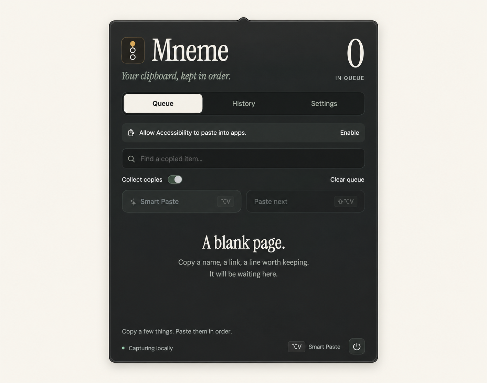

# Mneme · μνήμη

**Your clipboard, kept in order.**

A native macOS menu-bar clipboard with an ordered paste queue and optional AI matching for the field you're filling.


<sub>Presentation image polished from an app screenshot.</sub>

## Features

- **Copy in order, paste in order.** Queue up to 100 text items, rearrange them, and restore the last sent item.
- **Search your history.** Keep the latest 200 copies; optionally remember history between launches.
- **Smart Paste.** TypeSafe's Jev selects the copied item that fits the focused field. Review suggestions, or opt into automatic pasting of strong matches.
- **Made for Mac.** Configurable global shortcuts, a native menu-bar icon, and a paper-and-glass interface with Instrument Serif and DM Sans.
- **Local by default.** Capture pause, app exclusions, and best-effort filtering for concealed clipboard content and recognizable secrets.

## Get started

Requires **macOS 14+** and **Xcode Command Line Tools / Swift 5.9+**. Smart Paste also needs [uv](https://docs.astral.sh/uv/getting-started/installation/) and a TypeSafe API key.

```sh
git clone https://github.com/Ayush0054/mneme.git
cd mneme
bash scripts/package-app.sh
open dist/Mneme.app
```

Grant **Mneme.app** access in **System Settings → Privacy & Security → Accessibility** to paste into other apps. Quit Mneme before rebuilding; a rebuild may require re-adding its Accessibility permission.

For optional Smart Paste:

```sh
bash scripts/setup.sh
cp .env.example .env   # first-time setup only
```

Set `TYPESAFE_API_KEY` in `.env`, then enable **TypeSafe Smart Paste** in Mneme's Settings. You can instead save the key in Settings using macOS Keychain. A nonempty `.env` key takes precedence; `.env` is ignored by Git and never bundled.

## Use it

| Action | Default shortcut |
| --- | --- |
| Smart Paste | `⌥V` |
| Paste next | `⇧⌥V` |
| Open / close panel | `⌥Space` |

Leave **Collect copies** on, copy several values, focus a destination field, and use **Paste next**. Move between fields yourself. Ordinary `⌘V` is unchanged. Change shortcut presets in Settings.

**Smart Paste** reads the focused field's Accessibility metadata and sends up to 12 candidate excerpts (1,200 characters each) plus field context to TypeSafe. Jev chooses an item ID; Mneme pastes the original text unchanged after checking the destination. Unclear matches are left for you to choose.

## Current limits

This is an early development version: **plain text only**, with no image/file history, sync, OCR, or automatic form navigation. A sent paste keystroke does not guarantee the destination accepted it; use **Return last sent item to queue** if needed.

Capture and ordered paste stay local. Only explicit Smart Paste requests use the cloud. History stays in memory by default; optional saved history is local and **unencrypted**. Secret filtering is not comprehensive.

Build locally: there is no notarized download yet. Keep the project folder in place—the packaged app locates `.env` and the Python helper there. Repackage after moving the folder. Fonts and their SIL Open Font Licenses are in [Resources/Fonts](Resources/Fonts).
